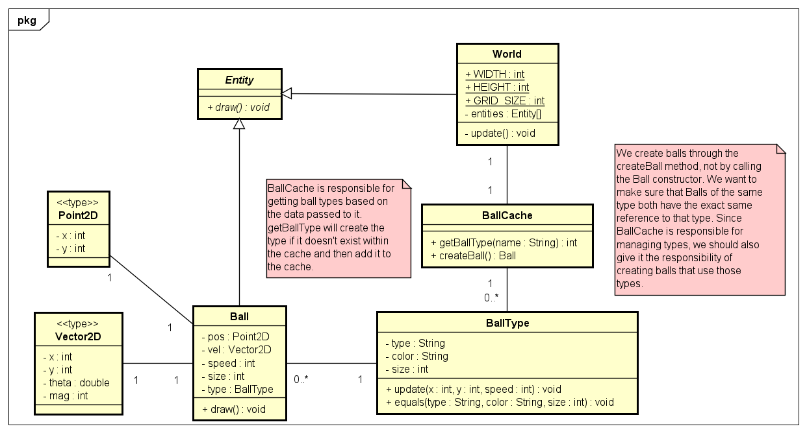
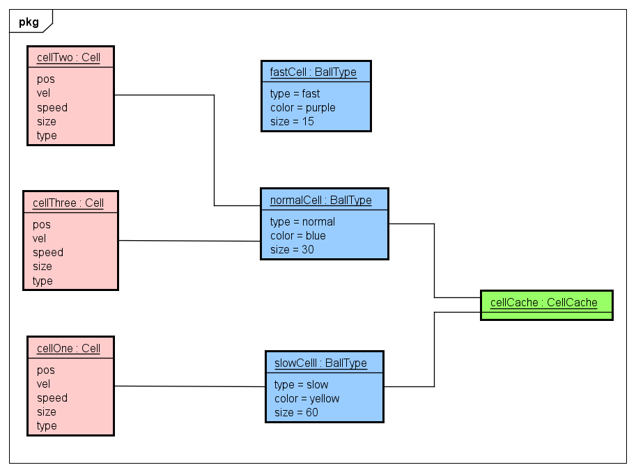

---
# Feel free to add content and custom Front Matter to this file.
# To modify the layout, see https://jekyllrb.com/docs/themes/#overriding-theme-defaults

layout: default
title: Structural

---
# Structural - Flyweight

## Brief Overview
The flyweight pattern is a useful structural pattern that addresses memory usage when dealing with a large amount of objects. 

The idea behind a flyweight is that we shouldn't have to repeat data that is consistent across an object, especially if said data takes up a lot of memory. Instead, we should take all the data that we expect to stay constant and move it to another object (this is the flyweight). After moving the intrinsic data, what's left is the extrinsic data of the object, or the data that we expect to be able to modify.

In a sense, we have now cached the heavier parts of the objects. Usually, there will be an additional helper class to keep track of the pool of flyweights.

## Implementation

For my program, I made use of flyweights to cache data that would get repeated. Essentially, I wanted to create "classes" for my entities; I wanted to be able to create slow, normal, and fast balls. However, I did not want to copy any intrinsic data over to each object. This included the name of the ball type, its color, and its size. This is where I used the flyweight pattern to identify the "type" of ball that I wanted based on the intrinsic data that I chose. Below is the implementation class diagram and the object view of the system so far.

## Diagrams

One thing to note is how we don't have two separate types for `normalBall`. We have one `normalBall` type and every Ball that wants to be a normal ball uses the same instance of `normalBall`.

## Live Demo

    <canvas class="canvas"></canvas>

